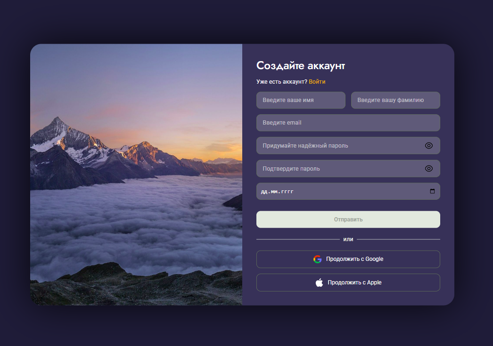
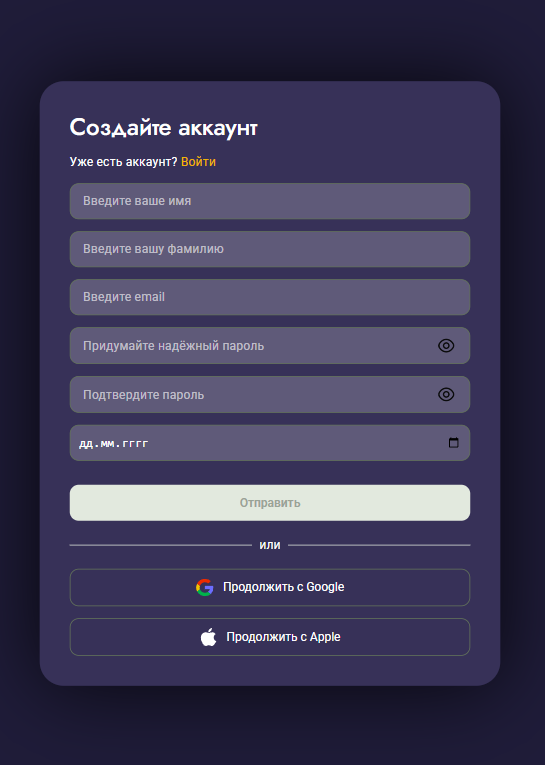
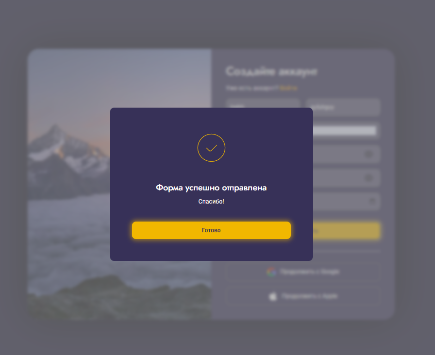

# Registration form

## Technologies

React + TypeScript
React-hook-form + Zod
Storybook

## How to launch

1. ```npm install``` - installing dependencies
2. ```npm run dev``` - launching a project in development mode




